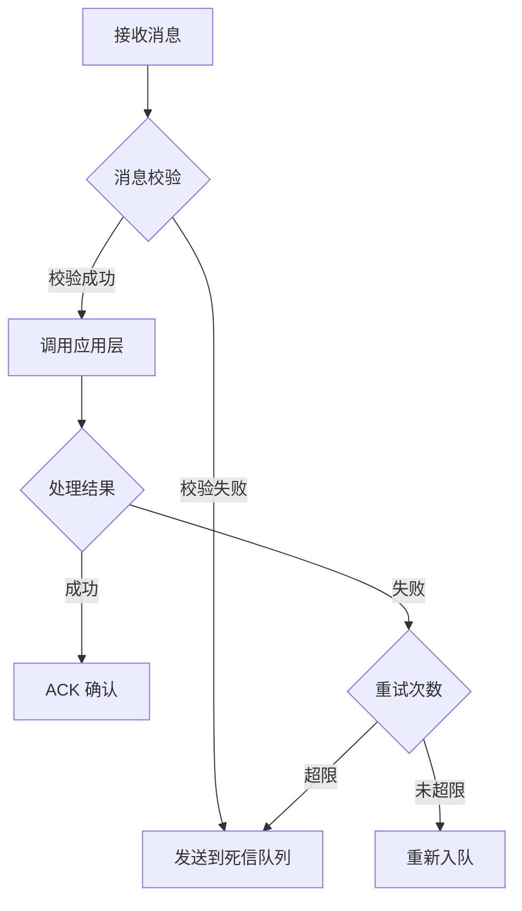
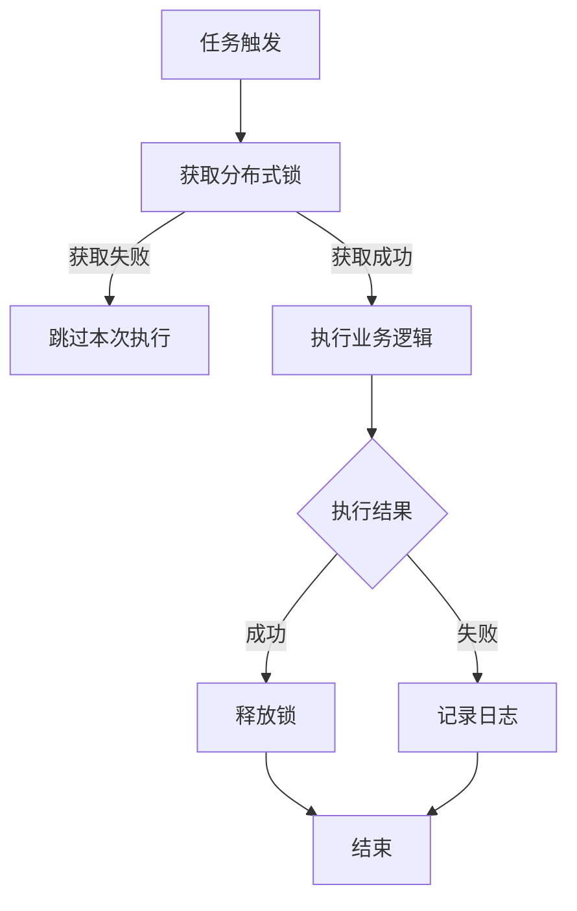

# 第五章：入口层设计（Starter 层）

## 章节目标

完成入口层（Starter 层）设计，包括：
1. **Controller 层**：定义 HTTP 接口入口
2. **MQ 层**：定义消息队列消费者
3. **Task 层**：定义定时任务

---


## 1. Controller 层

### 1.1 Controller 总览

| Controller 名称 | 职责 | 对应应用服务 | 路由前缀 |
|----------------|------|------------|---------|
| {Controller1} | {职责描述} | {应用服务1} | /{prefix} |

---

### 1.2 Controller：{Controller 名称}

**基本信息**

| 字段 | 值 |
|------|-----|
| Controller 名称 | {Controller 名称} |
| 路由前缀 | `/{前缀}` |
| 职责 | {职责描述} |
| 对应应用服务 | {应用服务名称} |

**接口列表**

| 接口名称 | HTTP 方法 | 路径 | 应用层方法 | 说明 |
|---------|----------|------|-----------|------|
| {接口1} | POST | /{path} | {应用方法} | {说明} |
| {接口2} | POST | /{path} | {应用方法} | {说明} |

---

#### 接口设计：{接口1}

**基本信息**

| 字段 | 值 |
|------|-----|
| 接口名称 | {接口名称} |
| HTTP 方法 | POST |
| 路径 | /{path} |
| 应用层方法 | {应用服务}.{方法名} |
| 描述 | {接口描述} |

**请求定义**

**请求头**：

| 字段名 | 类型 | 必填 | 说明 |
|-------|------|------|------|
| Content-Type | string | 是 | application/json |
| Authorization | string | 是 | Bearer {token} |

**请求参数（Request Body）**：

**参数命名格式**：`{动作} + {聚合名} + Param`

**禁止使用原始数据类型**：所有接口参数必须是对象类型，不能使用原始数据类型（string, number, boolean 等）。

| 字段名 | 类型 | 必填 | 约束 | 说明 |
|-------|------|------|------|------|
| {字段1} | {类型} | 是 | {约束规则} | {字段说明} |
| {字段2} | {类型} | 否 | {约束规则} | {字段说明} |

**请求示例**：

```json
{
  "{字段1}": "{值1}",
  "{字段2}": "{值2}"
}
```

**响应定义**

**成功响应（200 OK）**：

```json
{
  "code": 200,
  "message": "{成功消息}",
  "data": {
    "{字段1}": "{值1}"
  }
}
```

**失败响应（200 OK，但 code ≠ 200）**：

```json
{
  "code": 400,
  "message": "{错误信息}",
  "data": null
}
```

---

## 2. MQ 层

### 2.1 MQ 总览

| 消费者名称 | 订阅主题 | 职责 | 对应应用服务 |
|-----------|---------|------|------------|
| {消费者1} | {topic/queue} | {职责描述} | {应用服务1} |

---

### 2.2 消费者：{消费者名称}

**基本信息**

| 字段 | 值 |
|------|-----|
| 消费者名称 | {消费者名称} |
| 订阅主题 | {topic/queue} |
| 职责 | {职责描述} |
| 对应应用服务 | {应用服务}.{方法名} |

**消息定义**

**消息结构**：

```json
{
  "{字段1}": "{值1}",
  "{字段2}": "{值2}"
}
```

**处理逻辑**



---

## 3. Task 层

### 3.1 Task 总览

| 任务名称 | 调度策略 | 职责 | 对应应用服务 |
|---------|---------|------|------------|
| {任务1} | {Cron 表达式} | {职责描述} | {应用服务1} |

---

### 3.2 任务：{任务名称}

**基本信息**

| 字段 | 值 |
|------|-----|
| 任务名称 | {任务名称} |
| 调度策略 | {Cron 表达式或固定间隔} |
| 执行超时 | {超时时间} |
| 对应应用服务 | {应用服务}.{方法名} |

**执行逻辑**


